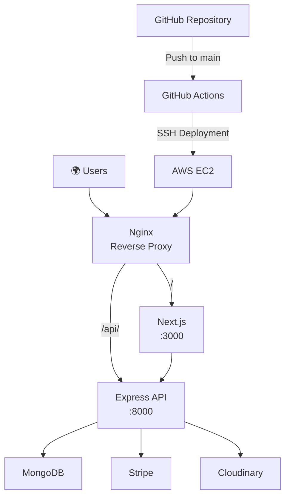
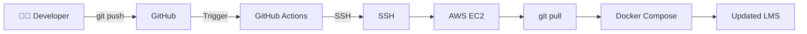
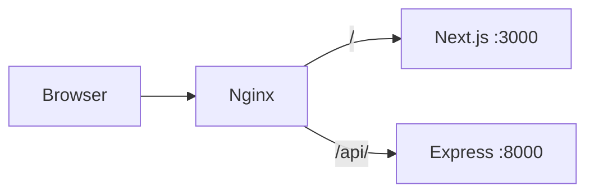

# Deployment Architecture

## Production Overview

The LMS is deployed on **AWS EC2** using Docker, Docker Compose, Nginx, and GitHub Actions.

## CI/CD Pipeline

Every push to the `main` branch triggers the deployment workflow.

## Nginx Routing

## Deployment Documentation

For the complete deployment setup and configuration, see:

**[Deploying a MERN Stack Web App with Docker, Nginx, and GitHub Actions on AWS EC2](https://medium.com/@muhammadsaim32/deploying-a-mern-stack-web-app-with-docker-nginx-and-github-actions-on-aws-ec2)**
