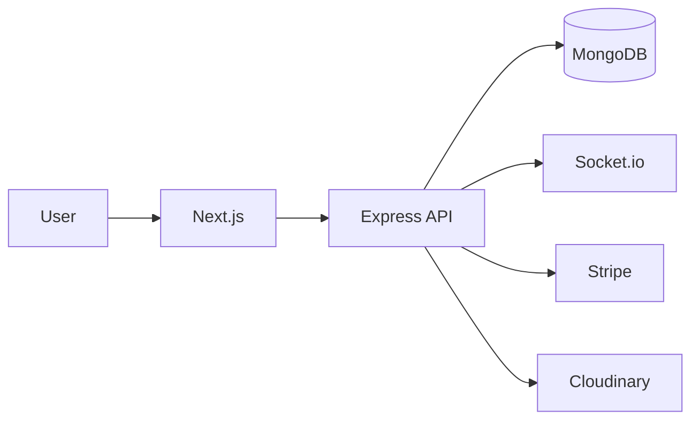

# LMS — Learning Management System

A full-stack Learning Management System built with **Next.js, Node.js, Express, and MongoDB**.

The platform provides course management, video-based learning, authentication, payments, an admin dashboard, and real-time notifications.

## ✨ Features

* 🔐 Email, Google & GitHub authentication
* 📚 Course and lesson management
* 🎥 Video-based learning
* 💳 Stripe payments
* 👨‍💼 Admin dashboard
* 🔔 Real-time notifications with Socket.io
* ⭐ Course reviews
* ☁️ Cloudinary media storage
* 📱 Responsive UI

## 🛠️ Tech Stack

**Frontend**

* Next.js 16
* React
* Redux
* Tailwind CSS
* Shadcn UI

**Backend**

* Node.js
* Express.js
* MongoDB
* Socket.io

**Services & Infrastructure**

* Stripe
* Cloudinary
* Docker
* Nginx
* AWS EC2
* GitHub Actions

## 🏗️ Architecture



Detailed architecture:

➡️ [`ARCHITECTURE.md`](./ARCHITECTURE.md)

## 🚀 Local Setup

```bash
git clone https://github.com/MuhammadSaim32/lms.git
cd lms
```

Install dependencies:

```bash
cd client
npm install

cd ../server
npm install
```

Configure:

```text
client/.env.local
server/.env
```

Run the application:

```bash
# Server
cd server
npm run dev

# Client
cd client
npm run dev
```

Or:

```bash
docker compose up -d
```

## ☁️ Deployment

```text
GitHub
   ↓
GitHub Actions
   ↓
AWS EC2
   ↓
Docker Compose
   ↓
Nginx
   ↓
Next.js + Express
```

➡️ [`DEPLOYMENT-ARCHITECTURE.md`](./DEPLOYMENT-ARCHITECTURE.md)

## 🤖 AI-Assisted Design

The application's UI and design were developed with the assistance of AI. The architecture, backend, APIs, integrations, and deployment were implemented as part of the project.

## 📚 Documentation

* [`ARCHITECTURE.md`](./ARCHITECTURE.md) — Application architecture
* [`DEPLOYMENT-ARCHITECTURE.md`](./DEPLOYMENT-ARCHITECTURE.md) — Deployment & CI/CD
* [`server/API_DOCS.md`](./server/API_DOCS.md) — API documentation

## 🔗 Links

* [GitHub](https://github.com/MuhammadSaim32/lms)
* [DeepWiki](https://deepwiki.com/MuhammadSaim32/lms)
* [Deployment Guide](https://medium.com/@muhammadsaim32/deploying-a-mern-stack-web-app-with-docker-nginx-and-github-actions-on-aws-ec2)
