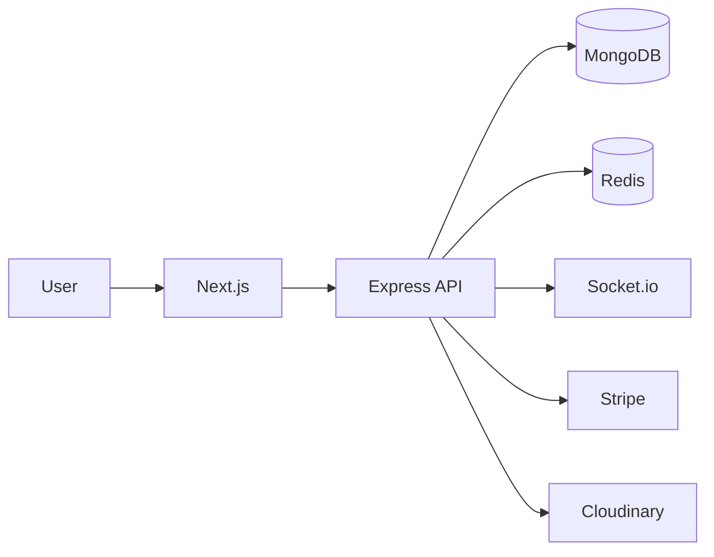

# LMS — Learning Management System

A full-stack Learning Management System built with **Next.js, Node.js, Express, MongoDB, Redis, and Socket.io**.

The platform supports course management, video-based learning, payments, authentication, admin management, and real-time notifications.

## ✨ Features

* 🔐 Email, Google & GitHub authentication
* 📚 Course and lesson management
* 🎥 Video-based learning
* 💳 Stripe payments
* 👨‍💼 Admin dashboard
* 🔔 Real-time notifications with Socket.io
* 👤 User profiles and course reviews
* ☁️ Cloudinary media storage
* ⚡ Redis integration
* 📱 Responsive UI
* 🐳 Dockerized deployment

## 🛠️ Tech Stack

**Frontend**

* Next.js 16
* React
* Redux
* Tailwind CSS
* Shadcn UI

**Backend**

* Node.js
* Express.js
* MongoDB
* Redis
* Socket.io

**Services & Infrastructure**

* Stripe
* Cloudinary
* Docker
* Nginx
* AWS EC2
* GitHub Actions

## 🏗️ Architecture



Detailed architecture:

➡️ [`ARCHITECTURE.md`](./ARCHITECTURE.md)

## 🚀 Local Setup

```bash
git clone https://github.com/MuhammadSaim32/lms.git
cd lms
```

Install dependencies:

```bash
cd client && npm install
cd ../server && npm install
```

Configure your environment variables in:

```text
client/.env.local
server/.env
```

Then run the applications:

```bash
# Server
cd server
npm run dev

# Client
cd client
npm run dev
```

Or use Docker Compose:

```bash
docker compose up -d
```

## ☁️ Deployment

The application is deployed using:

```text
GitHub
   ↓
GitHub Actions
   ↓
AWS EC2
   ↓
Docker Compose
   ↓
Nginx
   ↓
Next.js + Express
```

Detailed deployment and CI/CD documentation:

➡️ [`2-deployment-and-cicd.md`](./2-deployment-and-cicd.md)

## 🤖 AI-Assisted Design

The application's UI and design system were developed with the assistance of AI, while the application architecture, backend, APIs, integrations, and deployment were implemented as part of the project.

## 📚 Documentation

* [`ARCHITECTURE.md`](./ARCHITECTURE.md) — System architecture & diagrams
* [`2-deployment-and-cicd.md`](./2-deployment-and-cicd.md) — AWS EC2, Docker, Nginx & CI/CD
* [`server/API_DOCS.md`](./server/API_DOCS.md) — Backend API documentation

## 🔗 Links

* [GitHub Repository](https://github.com/MuhammadSaim32/lms)
* [DeepWiki](https://deepwiki.com/MuhammadSaim32/lms)
* [Deployment Guide](https://medium.com/@muhammadsaim32/deploying-a-mern-stack-web-app-with-docker-nginx-and-github-actions-on-aws-ec2)
